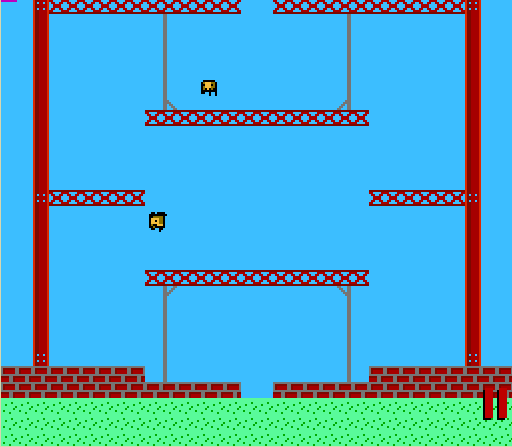

# Super Bread Pan

I was mucking about with [Millfork](https://karols.github.io/millfork/) a few years back, and wanted to try my hand at a simple game — a Super Crate Box clone for the Famicom/NES.

I didn’t get very far (past rendering/movement), but I had fun. ^^

## Meta
Code: CC0  
Art: Copyright © Vlambeer
